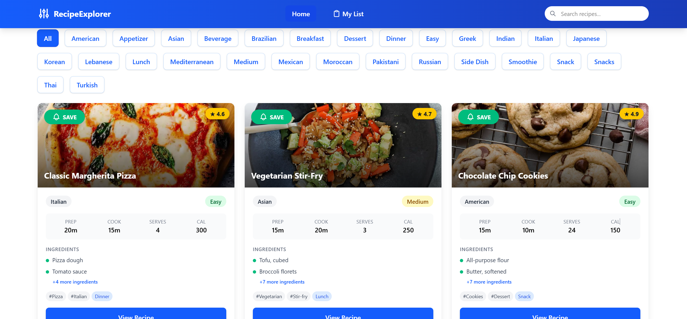

# RecipeExplorer

RecipeExplorer is a React application that allows users to discover, search, and save recipes for their cooking adventures. The app fetches recipe data from an API and provides a user-friendly interface to explore and manage your favorite recipes.



## 🍳 Features

- **Recipe Discovery**: Browse through a variety of recipes fetched from an external API
- **Search Functionality**: Find recipes by keywords and ingredients
- **Filtering Options**: Filter recipes by categories or types
- **Personal Cooking List**: Save your favorite recipes to a personal cooking list
- **Persistent Storage**: Your cooking list is saved in localStorage for easy access across sessions
- **Responsive Notifications**: Get feedback when adding or removing recipes from your list
- **Offline Access**: Access your saved recipes even when offline
- **Error Handling**: Robust error handling for API issues and data processing

## 🚀 Getting Started

### Prerequisites

- Node.js (v18.0.0 or later recommended)
- npm (v9.0.0 or later) or yarn package manager

### Installation and Setup

1. Clone the repository:

   ```bash
   git clone https://github.com/Vimal290704/Trimester_3_End_term_project
   cd RecipeExplorer
   ```

2. Install dependencies using npm:

   ```bash
   npm install
   ```

   Or using yarn:

   ```bash
   yarn install
   ```

3. Start the development server:

   ```bash
   npm run dev
   ```

   Or using yarn:

   ```bash
   yarn dev
   ```

4. Open your browser and navigate to `http://localhost:5173` (Vite's default port)

### Quick Setup From Scratch

If you're setting up the project from scratch:

```bash
# Create a new directory and navigate into it
mkdir RecipeExplorer && cd RecipeExplorer

# Initialize a new npm project
npm init -y

# Install all dependencies at once
npm install axios@1.8.4 react@19.0.0 react-dom@19.0.0 react-hot-toast@2.5.2 react-router-dom@6.30.0 react-toastify@11.0.5 sweetalert2@11.19.1

# Install all development dependencies
npm install --save-dev @eslint/js@9.21.0 @tailwindcss/postcss@4.1.3 @tailwindcss/vite@4.1.3 @types/react@19.0.10 @types/react-dom@19.0.4 @vitejs/plugin-react@4.3.4 autoprefixer@10.4.21 eslint@9.21.0 eslint-plugin-react-hooks@5.1.0 eslint-plugin-react-refresh@0.4.19 globals@15.15.0 postcss@8.5.3 tailwindcss@4.1.3 vite@6.2.0
```

Or use this single command to install all tools at once:

```bash
npm install axios@1.8.4 react@19.0.0 react-dom@19.0.0 react-hot-toast@2.5.2 react-router-dom@6.30.0 react-toastify@11.0.5 sweetalert2@11.19.1 @tailwindcss/vite@4.1.3 @eslint/js@9.21.0 @tailwindcss/postcss@4.1.3 @types/react@19.0.10 @types/react-dom@19.0.4 @vitejs/plugin-react@4.3.4 autoprefixer@10.4.21 eslint@9.21.0 eslint-plugin-react-hooks@5.1.0 eslint-plugin-react-refresh@0.4.19 globals@15.15.0 postcss@8.5.3 tailwindcss@4.1.3 vite@6.2.0
```

### Available Scripts

The project includes several scripts you can run:

- `npm run dev` - Run the development server with hot reloading
- `npm run build` - Build the application for production
- `npm run lint` - Run ESLint to check for code quality issues
- `npm run preview` - Preview the production build locally

## 🏗️ Project Structure

```
RecipeExplorer/
├── src/
│   ├── assets/
│   │   └── image.png
│   ├── components/
│   │   ├── RecipeCard.jsx
│   │   ├── FilterOption.jsx
│   │   ├── Home.jsx
│   │   └── CookingList.jsx
│   ├── context/
│   │   └── DataContext.jsx
│   ├── App.jsx
│   ├── main.jsx
│   └── index.css
├── public/
│   └── index.html
├── package.json
└── vite.config.js
```

## 💾 Data Management

RecipeExplorer uses React Context API for state management. The `DataContext` provides:

- Recipe data fetching through the DummyJSON API
- Search and filter functionality
- Cooking list state management
- Local storage persistence
- Toast notifications for user feedback
- Error handling

## 🔍 Core Functionality

### Recipe Fetching

The application fetches recipe data from the DummyJSON API:

```javascript
const RawData = useCallback(async () => {
  try {
    const response = await api.get(`https://dummyjson.com/recipes`);
    setApiWorking(true);
    return response.data.recipes;
  } catch (error) {
    console.error("Error fetching recipes:", error);
    setApiWorking(false);
    setError(error.message || "Error fetching recipes");
    return [];
  }
}, []);
```

### Cooking List Management

Users can save recipes to their cooking list:

```javascript
const saveRecipe = useCallback(
  (recipe, event) => {
    if (event) {
      event.preventDefault();
    }

    if (!recipe) {
      setError("Cannot save null recipe");
      return;
    }

    if (!doesContain(recipe)) {
      setCookList((prev) => [...prev, recipe]);
      toast.success(
        `${recipe.name || "Recipe"} added to your cooking list!`,
        toastOptions
      );
    }
  },
  [doesContain, toastOptions]
);
```

And remove recipes from their list:

```javascript
const removeFromCookList = useCallback(
  (recipeId) => {
    if (!recipeId) {
      setError("Cannot remove recipe without ID");
      return;
    }

    const recipe = cookList.find((item) => item && item.id === recipeId);
    if (recipe) {
      setCookList((prev) =>
        prev.filter((item) => item && item.id !== recipeId)
      );
      toast.info(`${recipe.name || "Recipe"} removed from your list`, {
        ...toastOptions,
        icon: "🗑️",
      });
    }
  },
  [cookList, toastOptions]
);
```

## 🔧 Technologies Used

The application uses the following libraries:

- **React (v19.0.0)** - UI library
- **React Router Dom (v6.30.0)** - For routing and navigation
- **Axios (v1.8.4)** - HTTP client for API requests
- **React-Toastify (v11.0.5)** - Notification system
- **React-Hot-Toast (v2.5.2)** - Alternative toast notification system
- **Tailwind CSS (v4.1.3)** - For styling and responsive design
- **Vite (v6.2.0)** - Build tool and development server
- **SweetAlert2 (v11.19.1)** - For enhanced alert dialogs
- **LocalStorage API** - For persistent data storage

## 🛠️ Environment Setup

### Setting Up Development Environment

1. **Install Node.js and npm**

   Download and install from [Node.js official website](https://nodejs.org/)

2. **Install Git**

   Download and install from [Git official website](https://git-scm.com/)

3. **Configure Environment Variables** (if needed)

   Create a `.env` file in the root directory for any environment variables:

   ```
   VITE_API_URL=https://dummyjson.com
   ```

4. **Editor Setup**

   For the best development experience, we recommend using Visual Studio Code with these extensions:

   - ESLint
   - Prettier
   - Tailwind CSS IntelliSense

## 🚀 Deployment

### Build for production

```bash
npm run build
```

This will create a `dist` folder with optimized production build.

### Preview production build locally

```bash
npm run preview
```

### Deploy to Netlify

The app is configured to be easily deployed to Netlify. Connect your repository and the deployment process will be handled automatically.

## 📱 Responsive Design

RecipeExplorer is designed to be fully responsive and work seamlessly across:

- Desktop computers
- Tablets
- Mobile phones

## 🔜 Future Enhancements

- User authentication system
- Recipe rating functionality
- Personal recipe creation
- Social sharing features
- Recipe reviews and comments
- Advanced filtering options

## 🐛 Troubleshooting

### Common Issues

1. **API Connection Failed**

   - Check your internet connection
   - Verify that the DummyJSON API is available
   - Check browser console for specific error messages

2. **Build Failures**

   - Make sure all dependencies are installed correctly
   - Clear the node_modules folder and reinstall dependencies
   - Check for any ESLint errors with `npm run lint`

3. **Styling Issues**
   - Ensure Tailwind CSS is configured correctly
   - Run `npx tailwindcss init -p` to create configuration files if missing

## 📄 License

This project is licensed under the MIT License - see the LICENSE file for details.

## 🙏 Acknowledgements

- DummyJSON for providing the recipe API
- React and the ecosystem of libraries that make this project possible
- All contributors and supporters of the project

---

Made with ❤️ by Vimal Kumar Yadav
